# 🚀 CI/CD Pipeline Documentation

## Overview

This project uses a robust CI/CD pipeline with GitHub Actions that ensures code quality, security, and reliability before any deployment. The pipeline enforces multiple quality gates that **must pass** before code can be merged.

## 🏗️ Pipeline Architecture

```mermaid
graph TD
    A[Code Push/PR] --> B[Security Scan]
    A --> C[Test Suite]
    A --> D[Integration Tests]

    B --> E[Docker Build]
    C --> E
    D --> E

    E --> F[Performance Tests]
    F --> G[Deployment Check]

    G --> H{All Tests Pass?}
    H -->|Yes| I[✅ Ready for Deployment]
    H -->|No| J[❌ Block Merge]

    I --> K[Notify Success]
    J --> L[Notify Failure]
```



## 🔒 Quality Gates

### 1. Security & Code Quality

- **Bandit**: Security vulnerability scanning
- **Safety**: Dependency vulnerability checking
- **Black**: Code formatting validation
- **isort**: Import sorting validation
- **Flake8**: Code linting
- **MyPy**: Type checking

### 2. Test Suite (Multi-Python)

- **Python 3.10, 3.11, 3.12**: Cross-version compatibility
- **Unit Tests**: Core functionality testing
- **Coverage Reports**: Code coverage analysis
- **Real AWS Integration**: Tests with actual AWS services

### 3. Integration Tests

- **Mocked AWS Services**: Safe integration testing
- **End-to-end Workflows**: Complete system validation

### 4. Docker Build & Security

- **Container Building**: Docker image creation
- **Trivy Scanning**: Container vulnerability scanning
- **Runtime Testing**: Container functionality validation

### 5. Performance Tests

- **Benchmark Testing**: Performance regression detection
- **Memory Profiling**: Resource usage validation
- **Initialization Speed**: Startup time validation

### 6. Deployment Readiness

- **File Validation**: Required files presence check
- **Syntax Validation**: Python syntax verification
- **Configuration Check**: Config template validation

## 🚦 Branch Protection Rules

The `main` branch is protected with the following rules:

- ✅ **All CI/CD jobs must pass** before merging
- ✅ **1 approving review** required
- ✅ **Stale reviews dismissed** on new commits
- ✅ **Conversation resolution** required
- ✅ **No force pushes** allowed
- ✅ **No branch deletion** allowed
- ✅ **Branches must be up-to-date** before merging

## 🛠️ Development Workflow

### Initial Setup

```bash
# Install development dependencies
make install-dev

# Set up pre-commit hooks
make setup-hooks

# Complete development environment setup
make dev-setup
```

### Daily Development

```bash
# Quick development check (format, lint, test)
make dev-check

# Run full CI pipeline locally
make ci-local

# Check current AWS costs
make cost-check
```

### Pre-commit Workflow

```bash
# Format code
make format

# Run security checks
make security

# Run all tests
make test

# Run tests with coverage
make test-coverage
```

## 📊 Available Commands

Run `make help` to see all available commands:

```bash
make help
```

Key commands:

- `make test` - Run all tests
- `make test-coverage` - Run tests with coverage
- `make lint` - Run linting checks
- `make format` - Format code
- `make security` - Run security scans
- `make docker-build` - Build Docker image
- `make ci-local` - Run full CI pipeline locally
- `make daily-report` - Run daily cost report
- `make cost-check` - Check current AWS costs

## 🔧 Configuration Files

### Core CI/CD Files

- `.github/workflows/ci.yml` - Main CI/CD pipeline
- `pyproject.toml` - Python project configuration
- `.pre-commit-config.yaml` - Pre-commit hooks
- `Makefile` - Development commands

### Quality Tools Configuration

- **Black**: Line length 100, Python 3.10+ targets
- **isort**: Black-compatible profile
- **Flake8**: Max line length 100, ignore E203/W503
- **MyPy**: Strict type checking with AWS module ignores
- **Pytest**: Auto async mode, coverage reporting
- **Bandit**: Medium severity security scanning

## 🚀 Deployment Process

### Automatic Deployment (Recommended)

1. Create feature branch from `main`
2. Make changes and commit
3. Push branch and create Pull Request
4. CI/CD pipeline runs automatically
5. All quality gates must pass ✅
6. Get code review approval
7. Merge to `main` triggers deployment pipeline

### Manual Deployment

```bash
# Run full release check
make release-check

# If all checks pass, deploy manually
# (deployment scripts would go here)
```

## 🔍 Troubleshooting

### Common CI/CD Failures

#### Security Scan Failures

```bash
# Check security issues locally
make security

# Fix bandit issues
bandit -r src/ --severity-level medium

# Check dependency vulnerabilities
safety check
```

#### Test Failures

```bash
# Run tests locally
make test

# Run with verbose output
python -m pytest tests/ -v --tb=long

# Run specific test file
python -m pytest tests/test_specific.py -v
```

#### Code Formatting Issues

```bash
# Auto-fix formatting
make format

# Check what would be changed
make format-check
```

#### Docker Build Issues

```bash
# Build locally
make docker-build

# Test container
make docker-test

# Debug container
docker run -it --entrypoint /bin/bash podcast-qa:latest
```

### Performance Issues

```bash
# Run performance tests
python -c "
import time
import asyncio
from src.cost_tracker import CostTracker
from src.config import get_settings

async def benchmark():
    settings = get_settings()
    tracker = CostTracker(settings)

    start = time.time()
    # Your performance test here
    end = time.time()

    print(f'Performance: {end-start:.4f}s')

asyncio.run(benchmark())
"
```

## 📈 Monitoring & Alerts

### GitHub Actions Notifications

- ✅ **Success**: Deployment ready notification
- ❌ **Failure**: Detailed failure analysis
- 📊 **Reports**: Coverage and security reports

### Local Development

- Pre-commit hooks catch issues early
- Make commands provide immediate feedback
- Real-time AWS cost monitoring

## 🔐 Security Best Practices

### Secrets Management

- AWS credentials in GitHub Secrets
- SMTP credentials in environment variables
- No hardcoded secrets in code

### Dependency Security

- Regular dependency vulnerability scanning
- Automated security updates
- Minimal container attack surface

### Code Security

- Static analysis with Bandit
- Type safety with MyPy
- Input validation and sanitization

## 📚 Additional Resources

### GitHub Actions

- [GitHub Actions Documentation](https://docs.github.com/en/actions)
- [Workflow Syntax](https://docs.github.com/en/actions/using-workflows/workflow-syntax-for-github-actions)

### Quality Tools

- [Black Documentation](https://black.readthedocs.io/)
- [pytest Documentation](https://docs.pytest.org/)
- [MyPy Documentation](https://mypy.readthedocs.io/)

### Docker

- [Docker Best Practices](https://docs.docker.com/develop/dev-best-practices/)
- [Container Security](https://docs.docker.com/engine/security/)

## 🎯 Next Steps

1. **Set up GitHub repository** with this CI/CD pipeline
2. **Configure branch protection** using `scripts/setup_branch_protection.py`
3. **Add team members** as collaborators
4. **Configure notifications** for CI/CD status
5. **Set up deployment environments** (staging, production)

---

**🚀 Your robust CI/CD pipeline is ready to ensure code quality and security!**
