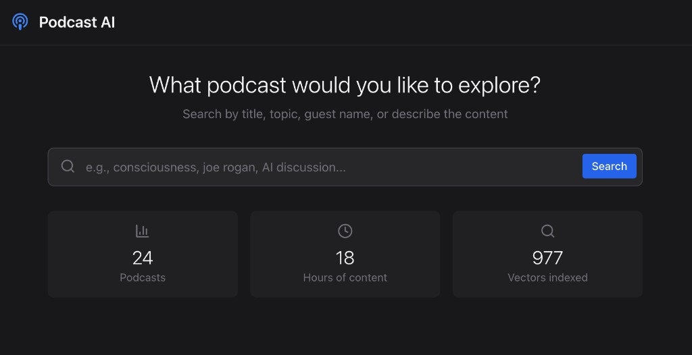

# Podcast Q&A System

A full-stack RAG application for searching across podcast transcripts and asking natural-language questions about individual episodes. Uses hybrid retrieval (dense + sparse vectors), cross-encoder reranking, and a corrective RAG pipeline powered by a local LLM.

Given a user's question and ~24 podcast episodes (905 text chunks), the system finds the right episode via two-stage retrieval, then produces a grounded answer with hallucination checking — all running locally via Ollama.



---

## Architecture

```
React UI (port 8080)
    │
    ▼
Flask API (port 3000)
    │
    ├── Search ──► Pinecone (hybrid vectors + reranking)
    │                  ▲
    │                  │ dense: nomic-embed-text (Ollama)
    │                  │ sparse: BM25Encoder (pinecone-text)
    │
    ├── Chat ──► LangGraph corrective RAG pipeline
    │                  │
    │                  └── llama3 (Ollama) for generation, grading, hallucination checks
    │
    └── SQLite ──► Full transcripts, chunk text, podcast metadata
```

### Tech Stack

| Layer | Technology |
|-------|-----------|
| **API** | Flask 3.1, flask-cors |
| **LLM** | Ollama — `llama3` (chat/generation), `nomic-embed-text` (768-dim dense embeddings) |
| **Vector DB** | Pinecone serverless — `podcast-hybrid` index (dotproduct), `pinecone-rerank-v0` cross-encoder |
| **Sparse vectors** | pinecone-text — `BM25Encoder`, `hybrid_convex_scale` |
| **RAG orchestration** | LangGraph state machine with conditional branching |
| **LLM wrapper** | LangChain (`langchain-ollama`) |
| **Text storage** | SQLite — `podcast_index_v2.db` (podcasts, chunks, summaries tables) |
| **Frontend** | React 18, Tailwind CSS, Axios, Lucide React |
| **Data collection** | spotipy (Spotify API), youtube-transcript-api, yt-dlp |

---

## How It Works

### 1. Data Collection & Indexing

```
Spotify saved episodes → youtube-transcript-api / yt-dlp → .txt transcript files
    │
    ▼
Chunking (500 words, 100 overlap) → SQLite (text) + Pinecone (vectors)
```

Each transcript is split into overlapping chunks. Before embedding, the podcast title is prepended to every chunk (`"NVIDIA Agentic AI | chunk text..."`) so each vector carries episode-level context. For every chunk:

- **Dense vector**: 768-dim embedding via Ollama (`nomic-embed-text`), L2-normalized
- **Sparse vector**: BM25 token weights via a corpus-fitted encoder

Both vectors are upserted together to Pinecone with metadata (`podcast_id`, `title`, `filename`, `chunk_index`). Chunk text and full transcripts are stored in SQLite.

### 2. Episode Search (hybrid retrieval + reranking)

1. Query → dense embedding + sparse BM25 vector
2. `hybrid_convex_scale` blends with alpha=0.7 (70% semantic, 30% keyword)
3. Single Pinecone hybrid query returns top 30 chunk candidates
4. `pinecone-rerank-v0` cross-encoder rescores all 30 candidates
5. Results aggregated to podcast level (best chunk score per episode)
6. Top 5 podcasts returned with scores and content previews

The two-stage approach (fast vector recall → accurate cross-encoder reranking) lets the system handle proper nouns via BM25 while capturing semantic meaning via dense vectors.

### 3. Chat (corrective RAG via LangGraph)

Once a user selects an episode, the chat flow runs a LangGraph state machine:

```
START → retrieve → grade → [generate | rewrite | fallback]
                              │           │          │
                     hallucination    retrieve      END
                        check            │
                      │      │        grade → ...
                    END    generate
```

- **Retrieve**: Hybrid search filtered to the selected podcast's chunks (top 5)
- **Grade**: Single batch LLM call scores all chunks for relevance
- **Generate**: Answers from relevant chunks only, with conversation history
- **Rewrite**: If no relevant chunks, the LLM rewrites the query and retries once
- **Hallucination check**: Verifies the answer is grounded in the source chunks
- **Fallback**: Loads the full transcript from SQLite if chunk retrieval fails entirely

| Path | LLM Calls |
|------|-----------|
| Happy path (retrieve → grade → generate → check) | 3 |
| Rewrite path (retry once, then generate) | 5 |
| Worst case (rewrite, then fallback) | 4 |

---

## Evaluation

An automated eval pipeline generates 5 diverse queries per podcast (topic, person, concept, casual, vague) using `llama3`, producing 120 queries with known ground truth.

| Metric | Baseline (4-query weighted) | Hybrid + Reranker |
|--------|---------------------------|-------------------|
| Hit@1 | 65.0% | **81.7%** |
| Hit@3 | — | **90.8%** |
| Hit@5 | — | **93.3%** |
| MRR | 0.730 | **0.863** |

Person/name queries saw the biggest improvement thanks to BM25 keyword matching. Vague queries (66.7% Hit@1) remain the hardest by design.

---

## API Endpoints

| Method | Path | Purpose |
|--------|------|---------|
| GET | `/api/health` | Health check with optional DB + Pinecone stats |
| POST | `/api/search` | Hybrid search — body: `{ query, top_k? }` |
| GET | `/api/podcasts` | List all indexed podcasts |
| GET | `/api/podcast/<id>` | Episode metadata, truncated content, chunk count |
| POST | `/api/chat` | Chat with episode — body: `{ podcast_id, message, session_id? }` |
| GET | `/api/chat/session/<id>` | Retrieve conversation history |
| GET | `/api/stats` | Podcast/chunk/vector counts, session stats |
| POST | `/api/summary/generate` | Generate LLM summary — body: `{ podcast_id }` |
| POST | `/api/summary/email` | Email summary — body: `{ podcast_id, email }` |

---

## Quick Start

### 1. Install Dependencies

```bash
# Backend
cd backend
pip install -r requirements.txt

# Frontend
cd frontend
npm install
```

### 2. Configure Environment

```bash
# Pinecone API key (project root .env)
echo "PINECONE_API_KEY=your-key-here" > .env

# Spotify credentials (for data collection)
cp config/env/config.env.example config/env/config.env
# Edit config.env with your Spotify Client ID & Secret
```

### 3. Start Ollama

```bash
ollama pull llama3
ollama pull nomic-embed-text
ollama serve  # runs on localhost:11434
```

### 4. Collect & Index Podcasts

```bash
python collect_podcasts.py --limit 10
# Then index via the search module (run from backend/):
# PodcastTwoTierSearch().index_all_podcasts_enhanced("transcripts")
```

### 5. Run the App

```bash
python run_server.py       # Backend on port 3000
cd frontend && npm start   # Frontend on port 8080
```

- Frontend: http://localhost:8080
- API health: http://localhost:3000/api/health

---

## Project Structure

```
├── run_server.py                          # Entry point — launches Flask on port 3000
├── collect_podcasts.py                    # CLI wrapper for data collection
├── .env                                   # Pinecone API key
│
├── backend/
│   ├── api/
│   │   └── controller.py                  # All Flask routes, service init
│   ├── search/
│   │   ├── podcast_semantic_search_complete.py  # Hybrid search, indexing, reranking
│   │   ├── corrective_rag.py              # LangGraph RAG pipeline
│   │   ├── summarization_service.py       # LLM episode summaries
│   │   ├── email_service.py               # SMTP email delivery
│   │   ├── reindex_hybrid.py              # Batch rebuild of Pinecone index
│   │   └── podcast_rag.py                 # Standalone CLI chat
│   └── data_collection/
│       ├── collect_transcripts.py         # Orchestrates Spotify + YouTube
│       ├── spotify_fetcher.py             # Spotify saved episodes export
│       └── download_youtube_transcripts.py # yt-dlp search + transcript download
│
├── frontend/
│   └── src/
│       └── App.js                         # React UI — search, results, chat
│
├── data/
│   ├── databases/podcast_index_v2.db      # SQLite: podcasts, chunks, summaries
│   ├── transcripts/                       # Raw .txt transcript files
│   ├── bm25_params.json                   # Fitted BM25 encoder parameters
│   └── exports/saved_podcasts.json        # Spotify episode export
│
├── eval/
│   ├── generate_eval_set.py               # Build eval queries from transcripts
│   ├── run_evaluation.py                  # Run retrieval eval, compute metrics
│   ├── eval_set.json                      # 120 generated queries with ground truth
│   └── eval_results.json                  # Latest eval run results
│
└── docs/
    └── interview_prep.md                  # Detailed technical deep dive
```
